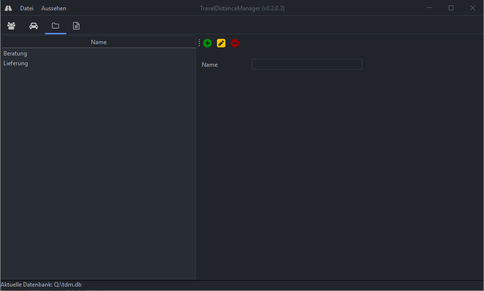

TDM - Travel Distance Manager
============================

**TDM** is a simple tool to track trips made to customers and to generate a report for tax declaration.


Reason for the project
============================

I started this project as an exercice to learn how to program in Java.

Current look of the application
============================

Customers view


Trips view


Trips types view



Report view


JSON configuration file for PostgreSQL (file extension .pg):
============================

```
{
	"Server":"<server>:<port>",
	"DatabaseName":"<database name>",
	"User":"<user>",
	"Password":"<password>"
}
```

Setup PostgreSQL database:
============================

Use the following script to create the tables and add a specific user:


[create_postgresql.sql](database/create_postgresql.sql)


